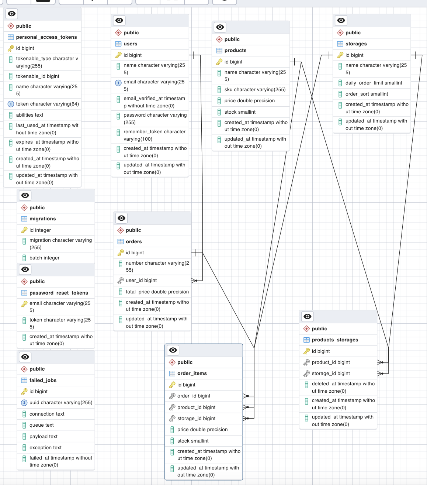

# Gereksinimler
 
* <a href="https://www.docker.com/products/docker-desktop/">Docker</a>
* <a href="https://www.postman.com/downloads/">Postman</a>

# Url
http://127.0.0.1:14280/api/v1

# Kurulum
* `docker-compose up -d`
* `docker-compose exec php composer install`
* `docker-compose exec php cp .env.example .env`
* `docker-compose exec php php artisan migrate:refresh`
* `docker-compose exec php php artisan db:seed`
* `docker-compose exec php systemctl start supervisor`
* `docker-compose exec php php artisan test --testsuite=Feature`

# Kullanım
* Gereksinimleri lütfen indirin
* Kurulum adımlarını eksiksiz ilerletin
* Kurulum adımlarında artisan db:seed komutu ile sizin için test verileri oluşturulacak
* Postman dosyalarını import edin ve postman üzerinde ilgili csa environment seçin.
* İlk olarak "user" servisi ile oluşturulan son test kullanıcısını çağıralım. Kullanıcı çağrıldığında otomatik olarak token bilgisi environment ortamınıza set edilecektir.
* Products servisimizden ürünlerimizi listeyebiliriz. Url kısmında sayfa ve limit bilgilerimizi belirtebiliriz. Standart 1 ve 20 değerleri mevcuttur.
* Order servisimizde siparişimizi oluşturuken postman body json yapımıza bağlı kalarak ilerleyelim ve products servisinde listelediğimiz ürünlerden id değerlerini ve dilediğimiz stock miktarını girin.
* Bunların dışında api feature test ile uygulamayı test edebilirsiniz. Sizin için bir ve birden fazla ürene sahip 10 adet sipariş oluşturucak. "php artisan test --testsuite=Feature".
* Laravel seeder komutunu kullanarak factory sınıflarının yardımıyla test verileri otomatik olarak oluşturulacaktır. "docker-compose exec php php artisan db:seed"

* Ürünlerin ilgili depolarının hesaplanması yada bulunması için abstrac bir sınıf tanımlandı. Bu sınıf daha sonrasında bir başka sınıfa extend edilip bir interface sahip sınıfa dahil edildi. OrderController sınıfı içersinde bu sınıf çağıralarak ilgili kurallara göre ürünlerin depoları ayarlandı.

* Sipariş numarası api isteğinde doğrudan verilirken. Sipariş kaydı için kuyruklama işlemi rabbitmq çalışmaktadır.

* Kuyruk işlemlerinin otomatik consume edilmesini tetiklemek için supervisor kullanılmaktadır. Supervisor .docker klasörü içerisindeki sprvsr.conf dosyasının image içerisindeki kopyasını çalıştırmaktadır.

* Database şemasını görmek için db.png görselinden faydalanabilirsiniz.

 # Users

 | method | url | explain 
 | :--- | :--- | :--- |
 | get   | /users| list last one |
 
   # Orders

 | method | url | explain
 | :--- | :--- | :--- |
 | post   | /orders | save |

 # Products
 | method | url | explain |
 | :--- | :--- | :--- |
 | get   | /products/{pageId}/{perPage} | list all products|

    - pageId : sayfa numarası integer
    - perPage : limit integer

## Görev Detayı

#### ❖ Sistemde n sayıda depo olabilir.
#### ❖ Depo isimlendirmeleri harf sıralaması şeklinde yapılabilir. (A, B, C...)
#### ❖ Her depo için 1 adet entegrasyon bulunmaktadır. Bu entegrasyon soap ya da rest servis kullanmaktadır.
#### ❖ Her depoda birden fazla ürün olabilir.
#### ❖ Her depoya rastgele sayıda ürün girişi yapılmalıdır.
#### ❖ Sipariş oluşturulduğunda içerisindeki ürünler öncelikle tek bir depodan karşılanmalıdır.
#### ❖ Eğer tamamı tek bir depodan karşılanamıyorsa depoların önceliklendirilmesine göre en öncelikli depoya sipariş gönderilmelidir.
#### ❖ Depolara günlük sipariş limiti konulabilmektedir.
#### ❖ Depo ve ürün atamaları sonucunda oluşan sipariş bilgisinin de veritabanında tutulması gerekmektedir.